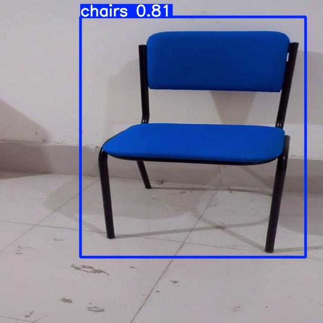
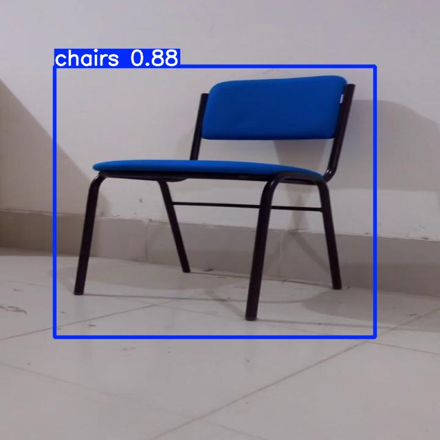

# Blue Chair Detection using YOLOv5

This project demonstrates how to train a custom YOLOv5 model to detect a specific type of blue chair. The notebook guides you through the entire process, from dataset preparation to model training and evaluation.

#### Key Insights:

- Dataset size: 126 images
- Dataset ratio:
  - Train: 114
  - Validation: 10
  - Test: 2
- [Download Dataset](https://app.roboflow.com/ds/wONygYJC8v?key=PNzG4ghht1)

## Table of Contents

- [Introduction](#introduction)
- [Steps](#steps)
  - [Step 1: Install Requirements](#step-1-install-requirements)
  - [Step 2: Assemble the Dataset](#step-2-assemble-the-dataset)
  - [Step 3: Train the Custom YOLOv5 Model](#step-3-train-the-custom-yolov5-model)
  - [Step 4: Evaluate the Model](#step-4-evaluate-the-model)
  - [Step 5: Run Test Inference](#step-5-run-test-inference)
- [Sample Results](#sample-results)
- [Conclusion](#conclusion)

## Introduction

In this tutorial, we assemble a dataset and train a custom YOLOv5 model to recognize a specific type of blue chair. The steps include gathering and labeling a dataset, training the model, evaluating its performance, and running test inferences.

## Steps

### Step 1: Install Requirements

First, we need to clone the YOLOv5 repository and install the necessary dependencies.

```python
# Clone YOLOv5 and install dependencies
!git clone https://github.com/ultralytics/yolov5  # clone repo
%cd yolov5
%pip install -qr requirements.txt  # install dependencies
%pip install -q roboflow

import torch
import os
from IPython.display import Image, clear_output  # to display images

print(f"Setup complete. Using torch {torch.__version__} ({torch.cuda.get_device_properties(0).name if torch.cuda.is_available() else 'CPU'})")
```

### Step 2: Assemble the Dataset

We need to assemble a dataset of images with bounding box annotations around the blue chair. This dataset should be in YOLOv5 format.

```python
!pip install roboflow

from roboflow import Roboflow
rf = Roboflow(api_key="YOUR_API_KEY")
project = rf.workspace("YOUR_WORKSPACE").project("YOUR_PROJECT")
version = project.version(4)
dataset = version.download("yolov5")
```

### Step 3: Train the Custom YOLOv5 Model

We train the YOLOv5 model using the assembled dataset. Various parameters such as image size, batch size, number of epochs, and weights for transfer learning can be specified.

```python
!python train.py --img 416 --batch 16 --epochs 25 --data {dataset.location}/data.yaml --weights yolov5s.pt --cache
```

### Step 4: Evaluate the Model

After training, we evaluate the model's performance on the validation dataset.

```python
!python val.py --data {dataset.location}/data.yaml --weights runs/train/exp/weights/best.pt --img 416
```

### Step 5: Run Test Inference

Finally, we run test inferences to see the model in action.

```python
!python detect.py --weights runs/train/exp/weights/best.pt --img 416 --conf 0.35 --source {dataset.location}/test/images
```

## Sample Results



&#x20;&#x20;

## Conclusion

This project demonstrates the process of training a custom YOLOv5 model to detect a specific type of blue chair. By following the steps outlined in the notebook, you can train your own object detection model for any custom dataset.

For more details, please refer to the notebook.

## Acknowledgements

- [Google Colab Notebook](https://colab.research.google.com/drive/1GW1A0O2DVQreAoQDnFFSrAe-y05gtQl5#scrollTo=odKEqYtTgbRc)
- [Roboflow Dataset](https://app.roboflow.com/ds/wONygYJC8v?key=PNzG4ghht1)
- [Ultralytics YOLOv5](https://github.com/ultralytics/yolov5)

